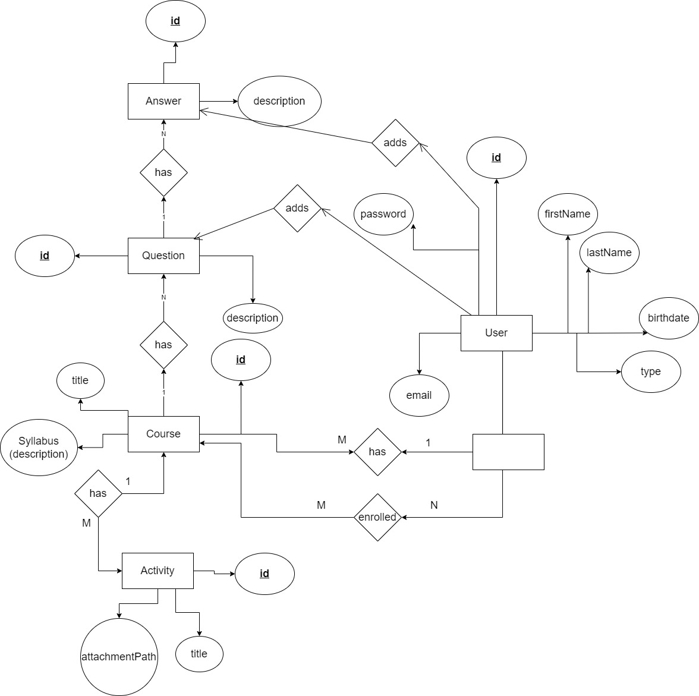

# database-optimization

# folder structur
- mongo_db --> contains the mongodb version scripts  to generate the database schema

- postgresql_db --> contains the sql version scripts  to generate the database schema

# er diagram
