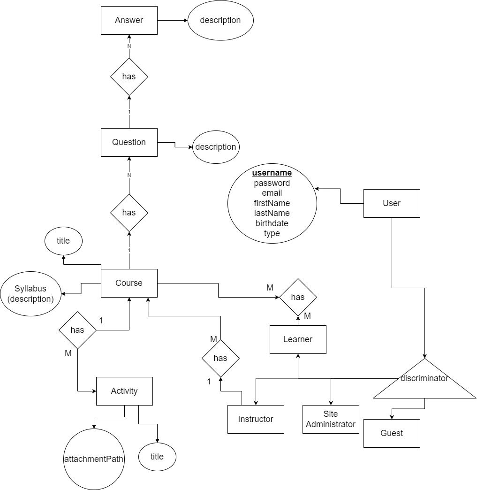

# folder structure

- schema.sql  --> a file used to create the schema of the database
- fill_data.sql --> a file used to fill the database tables with data

# er diagram

# steps to generate the database
- create a database and name it lms in postgres using the pgAdmin or using the psql bash `create database lms_db;`

- run the schama.sql file by opening it into pgAdmin after select the <b>lms_db</b> database (this will create the er diagram)
- run the fill_data.sql file by opening it into pgAdmin after select the <b>lms_db</b> database (this will fill the tables with data)

# system specification
<table>

<tr>
    <th>OS</th>
    <td>Windows 10</td>
</tr>
<tr>
    <th>CPU</th>
    <td>Intel core i7-7500U 2.7 GHz - 2.9 GHz</td>
</tr>
<tr>
    <th>Ram</th>
    <td>12GB DDR4</td>
</tr>
<tr>
    <th>Disk type</th>
    <td>HDD 931GB</td>
</tr>
</table>